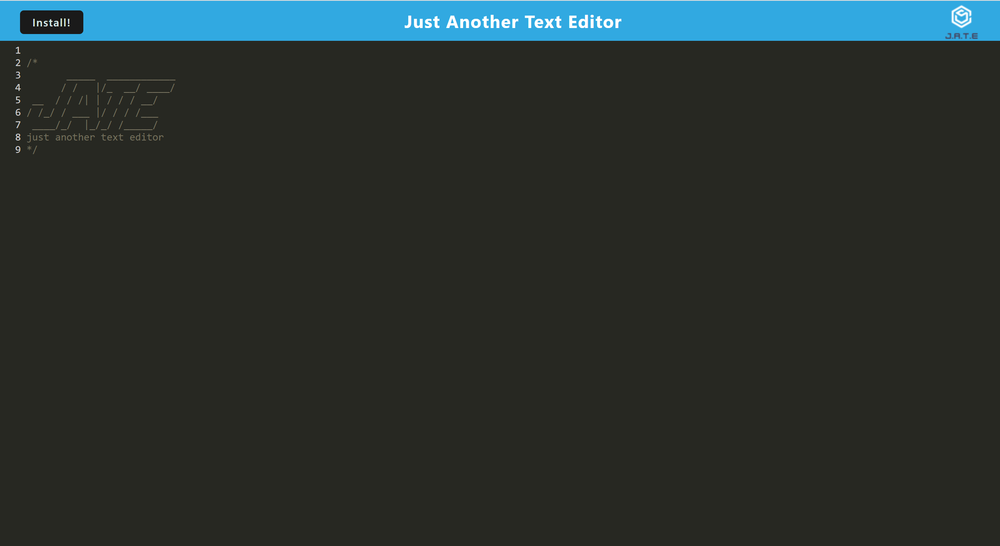
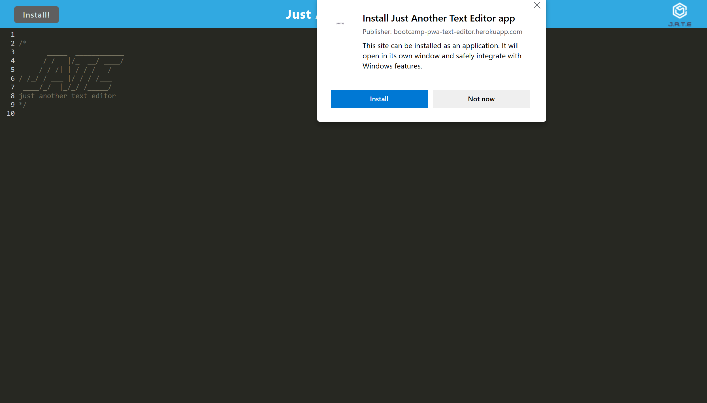
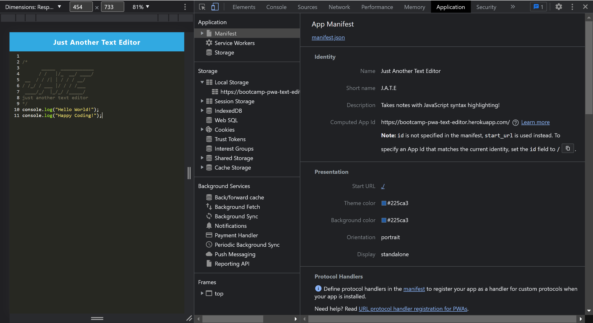
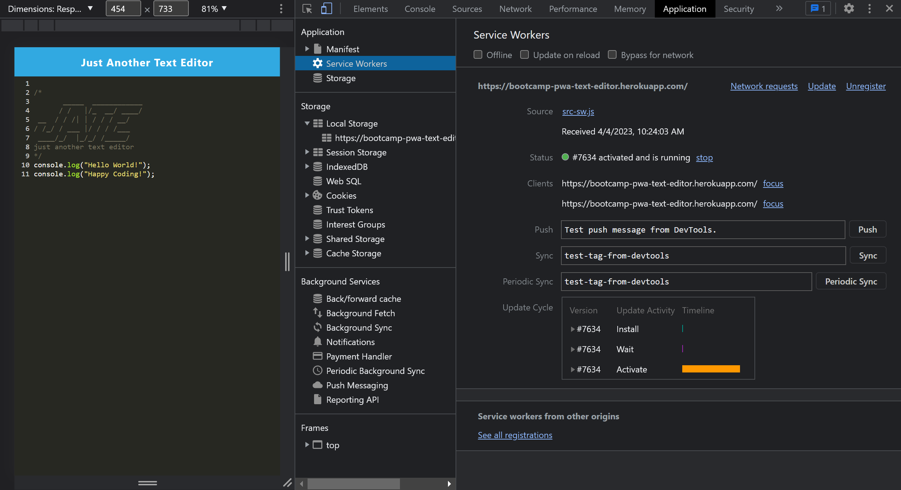
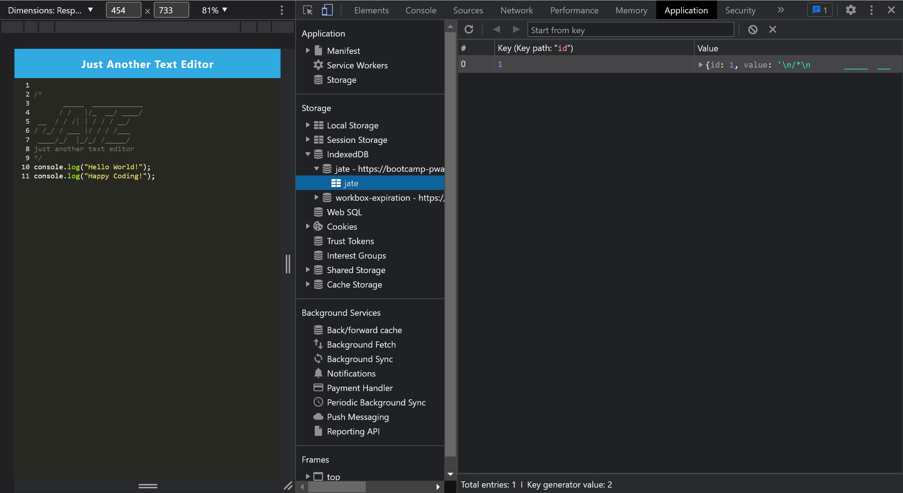

<!-- omit in toc -->
# PWA Text Editor

<!-- omit in toc -->
## Description

This is a text editor Progressive Web Application that runs in the browser where user can create notes or code snippets with or without an internet connection. The content in the text editor is saved with IndexedDB so that it can be retrieved when the app is closed and reopened. User can also download the web app as an icon on desktop. The app is using a package called `idb` to store and retrieve data and using workbox service worker to have static assets pre cached upon loading along with subsequent pages and static assets.

You can check out the deployed application from the link below:<br>
[https://bootcamp-pwa-text-editor.herokuapp.com/](https://bootcamp-pwa-text-editor.herokuapp.com/)

<!-- omit in toc -->
## Table of Contents
- [Installation](#installation)
- [Usage](#usage)
- [License](#license)

## Installation
- Install [Node.js v16](https://nodejs.org/en/blog/release/v16.16.0/) and [npm](https://www.npmjs.com/)
- Navigate to the root directory and install npm packages:
  ```
  npm install
  ```

## Usage
- Execute the app and run the server:
  ```
  npm run start
  ```
- Index page

- Install app

- App Manifest

- Registered Service Worker

- IndexedDB


## License
Copyright © 2022 [Claire Cho](https://github.com/clairehwcho).
